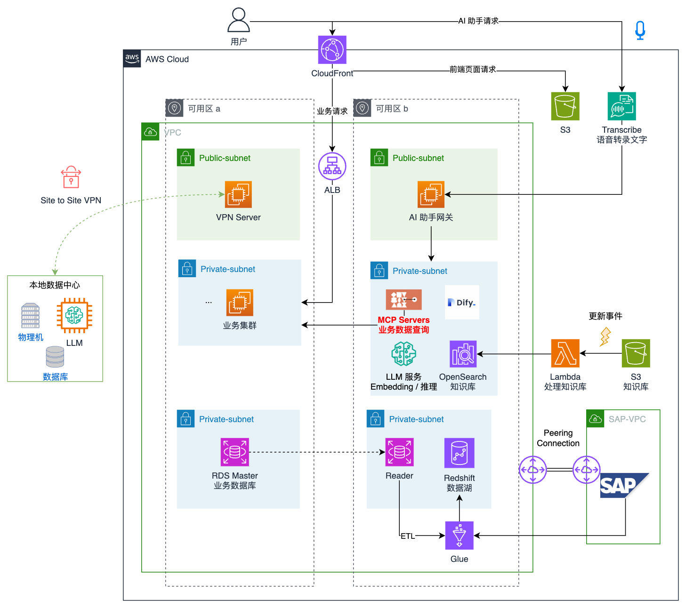
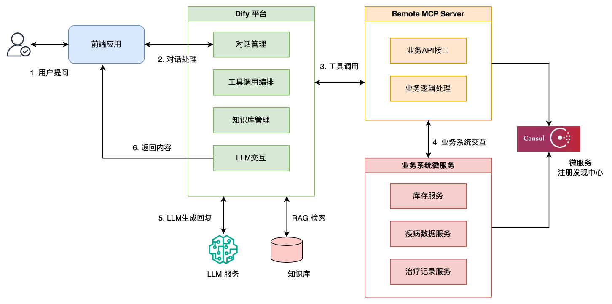

# 基于 AWS 构建企业 AI 助手：云南神农集团案例分析

## 1. 云南神农集团企业介绍

云南神农集团是云南省领先的农业科技企业，专注于现代农业技术研发、农产品生产加工及销售。近年来，随着数字化转型的实施，企业已完成了各核心业务系统向云端的迁移，其中最具代表性的是成功实施了 SAP Rise with AWS，将企业 ERP 系统部署至亚马逊云科技的中国宁夏区域，为神农集团带来了显著的业务价值。

然而，随着企业信息系统的不断丰富，一个新的挑战逐渐显现：如何让员工高效地获取分散在各个系统中的信息资源？

## 2. 企业 AI 助手的需求介绍

在与企业数字化团队和业务部门的深入沟通中，我们发现企业面临以下关键痛点：

1. **信息孤岛问题**：尽管各业务系统已迁移至云端，但系统间的数据流通不顺畅，员工需要在多个系统间切换获取完整信息。

2. **知识获取效率低**：企业积累了大量的业务知识、SOP 手册和最佳实践，但较为分散，员工查找信息耗时长。

3. **专业支持资源有限**：数字化支持团队和业务专家的资源有限，无法及时响应所有的日常咨询需求。

4. **新员工培训成本高**：新员工需要较长时间才能熟悉企业各系统的操作和业务流程，培训成本高。

基于以上痛点，神农集团提出了构建企业 AI 助手的需求，希望通过 AI 整合企业内部知识资源，并实现与业务系统的交互，具体需求包括：

- **统一知识访问入口**：提供一个集中的界面，让员工通过自然语言提问以获取分散在各业务系统/知识库中的信息。

- **业务系统交互**：代表用户执行简单的系统操作，如：分析各项数据并生成报料计划；查询药品库存和上游供应厂的疫病数据，生成针对性的治疗方案。

- **安全合规**：确保数据访问和处理符合企业安全策略和相关法规要求。

## 3. 企业 AI 助手的架构设计

### 3.1 架构概览



该架构主要包含以下几个核心组件：

1. **前端交互层**
   - 基于 VUE 开发的 Web 应用，部署在 Amazon S3 和 CloudFront 上

2. **AI 工作流及编排**
   - AI 助手网关，负责路由请求以及用户权限校验
   - 使用 Dify 作为 AI 工作流编排平台

3. **AI 推理层**
   - DeepSeek-R1-32B 或同类小参数量模型作为问题分类器以获得良好的速度
   - DeepSeek-V3 或同等级别，作为 AI 推理、Function Calling 和 Instruction Following 的模型

4. **知识管理层**
   - Amazon OpenSearch 作为向量数据库
   - BGE-large-zh-v1.5 作为向量模型，它在中文场景下表现良好且资源消耗较低。
   - BGE-Reranker 作为 Rerenk 模型，对候选检索结果进行精细排序，提升检索的精度。
   - Amazon S3 存储原始企业文档，Amazon Lambda 检索 S3 上原始文档的变化事件以触发知识库的 Re-indexing

5. **MCP Server（Model-Controller-Provider）**
   - 作为业务数据查询的中间件，在 AI 助手架构中扮演着关键角色，它使 AI 助手能够安全、高效地访问分散在各个业务系统中的数据，而无需了解底层系统的复杂性。通过统一的接口和权限控制，既保障了数据安全，又提高了 AI 助手的响应速度和准确性。

## 4. RAG 的实现及优化

检索增强生成（RAG）是企业 AI 助手的核心能力之一，它使系统能够基于企业内部知识库提供准确、相关的回答。我们采用了多项技术手段来优化 RAG 效果。

### 4.1 知识库构建

客户的知识库资料分散在多个系统中，格式各异（Word、PDF、PPT等）。我们构建了统一的处理流水线：

1. **文档转换**：使用 AWS Lambda 将不同格式的文档转换为纯文本。

2. **文档内容分段**：使用大模型将长文档根据章节分段：重新提炼章节名称，章节名称包含完整的章节链；在章节末尾插入明显的分隔符，例如 **-----**。

2. **文档分块**：根据上一步分段的结果，将每段切分为适合检索的小块（chunk），并保留适当的上下文重叠。

3. **向量化**：使用 Embedding 模型将文本块转换为向量存储到 Amazon OpenSearch，并建立高效的向量索引。

### 4.2 检索策略优化

为提高检索质量，我们实施了以下优化策略：

#### 4.2.1 混合检索

结合了关键词检索和语义检索的优势：

- **BM25算法**：基于关键词匹配，能够捕捉精确的术语和专有名词。
- **向量相似度检索**：基于语义理解，能够处理同义词和意图相似的查询。
- **混合排序**：综合考虑两种检索结果，动态调整权重。

#### 4.2.2 查询重写

使用大语言模型对用户原始查询进行重写和扩展：
- **提炼重点问题**：去除自然语言中无用的信息，提炼出简洁的问题。
- **查询分解**：将复杂问题分解为多个子查询。
- **查询扩展**：添加相关术语和同义词，增加召回率。

通过这些优化措施，神农集团的 AI 助手在知识问答方面达到了一定的准确率。

## 5. Tool Use 的实现及优化

除了知识问答能力外，AI 助手还需要能够与企业内部系统交互，执行实际的业务操作。这种能力被称为 Tool Use（工具使用），是提升 AI 助手实用性的关键。Dify 作为 AI 应用编排平台负责对话管理、工具调用编排和LLM交互，而MCP Server则专注于业务系统集成，为Dify提供业务功能API。这种职责分工使系统更加模块化，便于维护和扩展。
现有业务系统使用 Java SpringCloud 实现，使用 Consul 作为服务注册中心；MCP Server 使用 Python 语言、FastAPI 和 FastAPI-MCP 实现，并使用 consulate 包接入 SpringCloud 微服务框架。


安装依赖：
```bash
pip install consulate fastapi fastapi-mcp uvicorn requests pydantic
```

### Remote MCP Server 实现（业务系统集成层）
**[mcp_server.py](src/mcp_server.py)**

```python
# 连接 Consul 服务注册中心，获取相关业务的微服务地址
...

# 初始化FastAPI应用
app = FastAPI(title="MCP Server", description="业务系统集成API")

# 实现生成治疗方案的工具方法
@app.post("/api/treatment-plan", response_model=TreatmentPlanResponse, operation_id="generate_treatment_plan")
async def generate_treatment_plan(request: TreatmentPlanRequest):
   """
   根据猪只症状、日龄和猪场信息生成治疗方案
   
   - **symptoms**: 症状列表，例如['发热', '咳嗽', '食欲不振']
   - **age_days**: 猪只日龄，单位为天
   - **farm_id**: 猪场ID，用于查询该猪场可用药品
   """
   logger.info(f"处理治疗方案请求: 症状={request.symptoms}, 日龄={request.age_days}, 猪场ID={request.farm_id}")
   
   # 调用库存服务获取可用药品
   available_medicines = consul_client.call_inventory_service(request.farm_id)
   
   # 调用疫病数据服务获取相关疫病信息
   disease_data = consul_client.call_disease_service(request.symptoms, request.age_days)

   prompt = f"""
   基于以下信息生成猪禽治疗方案:
   
   症状: {', '.join(request.symptoms)}
   日龄: {request.age_days}天
   可能的疾病: {', '.join(disease_data.get('possible_diseases', []))}
   疾病流行情况: {disease_data.get('epidemic_status', '无数据')}
   
   可用药品清单:
   {json.dumps(available_medicines, indent=2, ensure_ascii=False)}
   
   请提供详细的治疗方案，包括:
   1. 推荐用药及用量
   2. 治疗周期
   3. 注意事项
   4. 预防措施
   """
   
   # 调用 LLM 生成治疗方案
   response_data = invoke(prompt)
   treatment_plan = response_data.get("choices", [{}])[0].get("message", {}).get("content", "无法生成治疗方案")
   
   # 记录治疗方案到业务系统
   ...
   
   return TreatmentPlanResponse(
      success=True,
      treatment_plan=treatment_plan,
      diagnosis=disease_data.get('possible_diseases', [])
   )
        
# 创建 MCP 服务器
mcp = FastApiMCP(
    app,
    name="MCP Server",                    # MCP 名称
    describe_all_responses=True,          # 展示所有响应模型
    describe_full_response_schema=True    # 展示完整 JSON 模式
)

# 挂载 MCP
mcp.mount()

# 启动服务
if __name__ == '__main__':
    import uvicorn
    port = int(os.environ.get('SERVICE_PORT'))
    uvicorn.run(app, host="0.0.0.0", port=port)
```

### 启动脚本
**[start_mcp_server.sh](src/start_mcp_server.sh)**

```bash
#!/bin/bash
# start_mcp_server.sh - 启动MCP Server的脚本

# 设置环境变量并导出，使子进程可以访问
export SERVICE_PORT=${SERVICE_PORT:-"8000"}
export CONSUL_HOST=${CONSUL_HOST:-"consul-server"}
export CONSUL_PORT=${CONSUL_PORT:-"8500"}
export OPENAI_API_URL=${OPENAI_API_URL:-"your-api-url-here"}
export OPENAI_API_KEY=${OPENAI_API_KEY:-"your-api-key-here"}

# 启动MCP Server
python mcp_server.py
```

### Dify 工具注册
待完成


## 6. 总结

通过与云南神农集团的紧密合作，我们共同构建了一个综合性的企业 AI 助手，通过将大语言模型与企业知识库和业务系统进行深度融合，创造了一个能够理解业务语境、解决实际问题的智能助手。